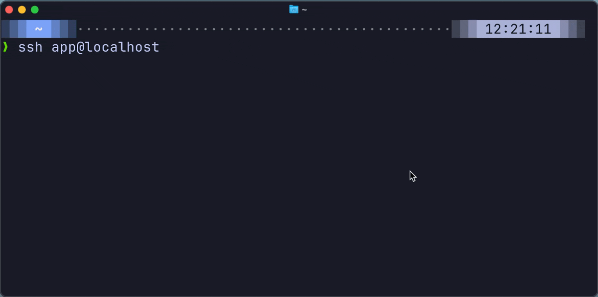

<p align="center">
  
  <h3 align="center"><a href="https://whispphp.com">Whisp</a></h3>
  <h4 align="center">Your pure* PHP SSH server ∙ the simplest & best way to build PHP SSH apps</h4>
</p>



> [!NOTE]
> Quick example: **sign our guestbook** ([See the code](https://github.com/WhispPHP/whisp.fyi/tree/main/apps))
> ```bash
> ssh guestbook@whisp.fyi
> ```
> Got a one-time secret to share? `ssh secrets@whisp.fyi`

Explore the full docs at **[WhispPHP.com »](https://whispphp.com)**

# Installation

We recommend using our [template project](https://github.com/whispphp/template-project) to get setup with Whisp & Laravel Prompts.

You can also add Whisp to an existing project with composer.

```bash
composer require whispphp/whisp
```

Coming soon: [Laravel package](https://github.com/whispphp/whisp-laravel), [Laravel starter kit](https://github.com/whispphp/laravel-starter-kit), and a [Docker image](https://github.com/WhispPHP/docker-image).

### Requirements
- PHP 8.2+
- FFI, pcntl, and libsodium modules

# Usage

Run the server on the port & IP you'd like, with the apps you want to make available. Each connection is forked to its own process and runs independently.

```php
<?php

// Setup server port & IP
$server = new Whisp\Server(port: 2222);

// Then, add your apps in 1 of 3 ways: auto discovery, array, or string

// Auto-discovery - we'll find all apps in the 'apps' directory and make them available
$server->run();

// Array
$server->run(apps: [
    'default' => 'full-path/howdy.php',
    'guestbook' => 'full-path/guestbook.php',
    'chat-{roomName}' => 'full-path/chat.php',
]);

// String - set the default script that's always ran
$server->run('full-path/howdy.php');
```

Once running you can test with:

**Default app**
```bash
ssh localhost -p2222
```

**Guestbook app**
```bash
ssh guestbook@localhost -p2222
```

## Environment variables available to each app
These are each available as environment variables.

| Variable | Description | Notes |
|----------|-------------|------|
| WHISP_APP | The name of the app being requested | |
| WHISP_CLIENT_IP | The IP address of the connecting client | |
| WHISP_USER_PUBLIC_KEY | Validated public key of the connecting user | This has been checked against their private key and can be trusted |
| WHISP_TTY | The TTY information for the connection | e.g. /dev/ttys072 |
| WHISP_USERNAME | The username used in the SSH connection | Unavailable when no username passed, or when the username is a valid app |
| WHISP_COLS | Requested terminal width in chars | |
| WHISP_ROWS | Requested terminal height | |
| WHISP_WIDTH_PX | Requested terminal width in pixels | |
| WHISP_HEIGHT_PX | Requested terminal height in pixels | |
| WHISP_PARAM_{name} | Passed only when using app params, i.e. chat-{roomName} | |


## Clients requesting apps
There are two ways for clients to request an available app:
1. **Username method:** `ssh app@server` - we use the 'username' here as the app name if it matches an available app.
    - Much cleaner, but means if you need the username for auth you can't define the app this way
2. **Command method:** `ssh server -t app` - request an interactive shell (`-t`) with the requested `app`


---

Explore the full docs at **[WhispPHP.com »](https://whispphp.com)**, which also show how to setup Whisp to listen on port 22, start on boot, and restart on failure with systemd.

# Live Examples

**Play the Dinorun game** ∙ [See the code](https://github.com/WhispPHP/whisp.fyi/blob/main/apps/dinorun.php)
```bash
ssh dinorun@whisp.fyi
```

**Share one-time secrets**
Fully encrypted, and fully secure. Only the person with the valid private SSH key can access them.
```bash
ssh secrets@whisp.fyi
```

**View your sunrise/sunset times** ∙ [See the code](https://github.com/WhispPHP/whisp.fyi/blob/main/apps/daylight.php)
```bash
ssh daylight@whisp.fyi
```

**Find your closest World Heritage Sites**
```bash
ssh elec@whisp.fyi
```

---

## Support & Credits

This was developed by Ashley Hindle. If you like it, please star it, share it, and let me know!

- [Bluesky](https://bsky.app/profile/ashleyhindle.com)
- [Twitter](https://twitter.com/ashleyhindle)
- Website [https://ashleyhindle.com](https://ashleyhindle.com)
